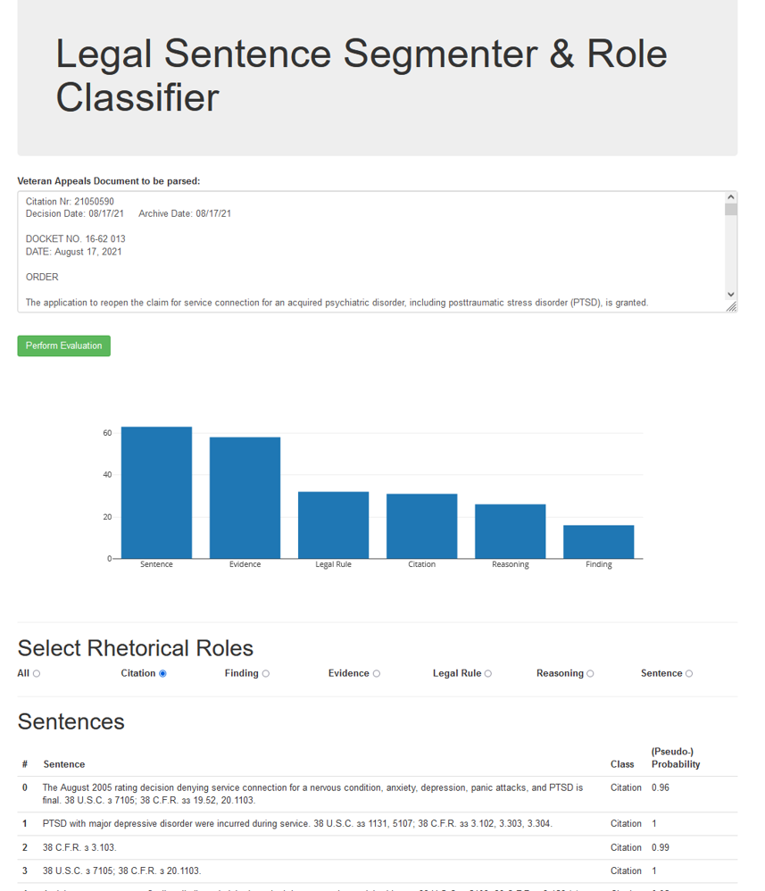
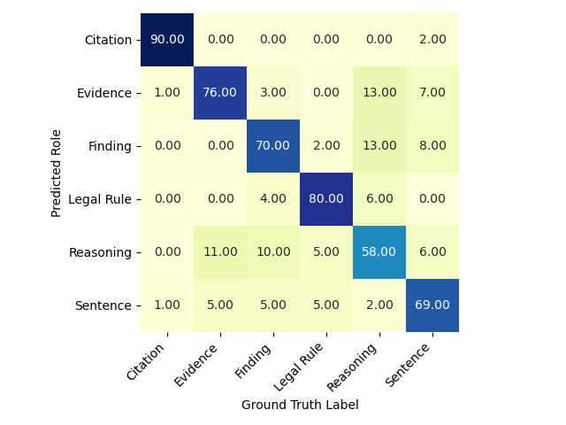
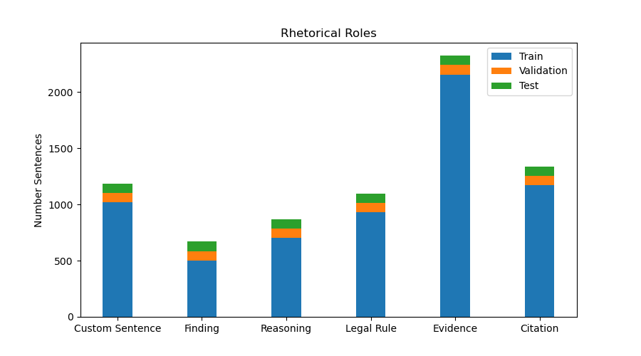

# Legal Sentence Role Classification
In US Case Law it is crucial that no judge overrules the decision of another judge. 
For legal work this means in consequence that, thousands of legal experts are employed only to scan decisions to find similar ones regarding a current case.
One approach to improve this process is to break all existing decision down into more granular sets of Information like Facts, Reasoning, Citations etc. and provide (based on those sets) e.g. summaries or a search engine for decisions.
Hence, in this work we tackle the issue of classifying the rhetorical role of a sentence in a decision.

As a basis we use [a dataset consisting of US Board of Veteran's Appeals Decisions]( https://github.com/LLTLab/VetClaims-JSON ) to build a NLP pipeline that is capable of:
1. splitting the decisions into sentences
2. classifying those sentences into the classes Citation,Evidence, Finding of Fact, Legal Rule, Reasoning and Custom Sentence

Further, we provide a small prototype of an wep application that first analyzes an arbitrary decisions and second allows to filter for the different categories.



___

Regarding the results of our best model that combines a LSTM NN with LegalBERT embeddings, we obtain similiar quantitative values as in the paper:

Vern R. Walker, Krishnan Pillaipakkamnatt, Alexandra M. Davidson, Marysa Linares and Domenick J. Pesce. 2019. "Automatic Classification of Rhetorical Roles for Sentences: Comparing Rule-Based Scripts with Machine Learning." In Proceedings of the Third Workshop on Automated Semantic Analysis of Information in Legal Text (ASAIL 2019), Montreal, QC, Canada, 10 pages.

and present the following confusion matrix on our test set based on the best model (LSTM + BERT Embeddings):




---

# Python requirements
Recommended Package Manager: Anaconda
## Required packages
-  conda install -c anaconda pandas 
- conda install -c conda-forge pydantic 
- conda install -c conda-forge spacy 
-  conda install -c anaconda pathlib 
- conda install -c conda-forge sentence-transformers 
- conda install -c anaconda tensorflow-gpu (or cpu version if no gpu available )
- conda install -c conda-forge tensorflow-hub
- install pytorch https://pytorch.org/get-started/locally/
- conda install -c anaconda seaborn 
- conda install -c anaconda scikit-learn 
- conda install -c conda-forge matplotlib 
- python -m spacy download en_core_web_md
- python -m spacy download en_core_web_lg

# General Instructions
1. Run data_provider.py to generate clean dataset (Two Pandas dataframes stored as pickle dump under data)
2. Download the spacy language model (execute this in commandline/terminal/shell):   
   ``` python -m spacy download en_core_web_lg```
3. For running the web application call from main folder( eventually the weight path to the model has to be adapted):
```uvicorn src.webapp:app --reload```
---
# Dataset Description



## Documents Dataframe:
- docId: Document ID
- dataset_type: Usable for Segmentation and/or classification (0 is both, 1 is only classification)
- text: Full Text of BVA decision
  
## Sentence Dataframe:
- sentID: Consists of Document ID +Paragraph Number + Sentence Number within Paragraph
- docID: Document ID
- dataset_type:  Usable for Segmentation and/or classification (0 is both, 1 is only classification)
- Split: Train/Val/Test on document level
- 
```          
# 8 documents dataset Type 1 + 3 documents dataset Type 0
test_documents =        ['1400029','1431031','1316146',
                        '1456911','1525217','1554165',
                        '1607479','1710389','18161103',
                        '19139412','19154420']
# 7 documents dataset Type 1 + 3 documents dataset Type 0
validation_documents =  ['1705557','1713615','1315144',
                        '1340434','1715225','1719263',
                        '1731026','19160065','19161706',
                        '18139471']# 7 documents dataset Type 1 + 3 documents dataset Type 0
   ```
- label: Rhetorical Rhole of Sentence (...)
- label_encoded: encoding of label
```label_encoding={'CitationSentence': 0, 'EvidenceSentence': 1, 'FindingSentence': 2, 'LegalRuleSentence': 3, 'ReasoningSentence': 4, 'Sentence': 5}```
- text: Full text of the sentence
___ 
###Contributions
This project is a group work as part of the Data Analysis in Applications Seminar at Technical University of Munich. The Group Members of this particular project are:
Philipp Bock, David Meyerolbersleben, Johannes Sasowski, Sarah Lockfisch, Surim Kim, Prodyumna Kumar Mohanta